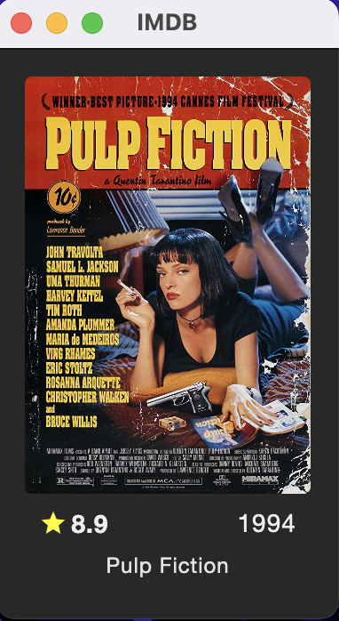
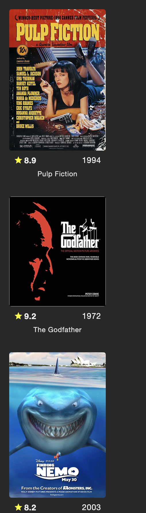

# Kotlin - 7 Days of Code

## Dia 1
Implementação de uma tela (interface gráfica) utilizando o Compose Desktop. Na tela, o título de um filme, poster e também sua nota no IMDB.
As impressões foram feitas manualmente, não há acesso a API nem nada do tipo, a imagem do poster se encontra na pasta `resources`.

## Dia 2
Implementação da mesma tela do primeiro dia, porém utilizando uma biblioteca para puxar a imagem direto de um link, sem necessidade de download.
Armazena informações num InputStream, depois armazenamos as informações da imagem num ByteArray, para convertê-lo em ImageBitmap.

## Dia 3
Melhora visual do conteúdo da janela, que estava igual ao apresentado no primeiro dia.

Agora, foram trabalhados alguns conceitos do JetPack Compose for Desktop: arredondar uma imagem, mudança de tamanho de fonte dos textos, inserção de ícones, estruturação mais complexa da página (utilizando Surface e Box), além de usar Dark Theme na aplicação.

## Dia 4
Possível agora exibir vários filmes na tela. Criação do modelo Movie, e utilização do LazyColumn para mostrar os filmes na tela.

## Dia 5
Alimentando projeto com a API do IMDB, especificamente os 250 filmes mais bem votados do site. Utilizada a biblioteca Retrofit para criar o método HTTP (GET) e cliente HTTP para comunicação com servidor.
